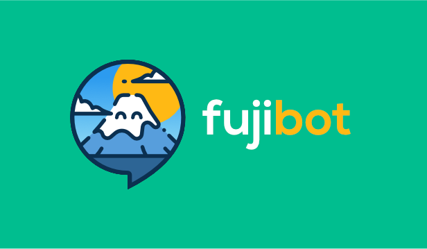
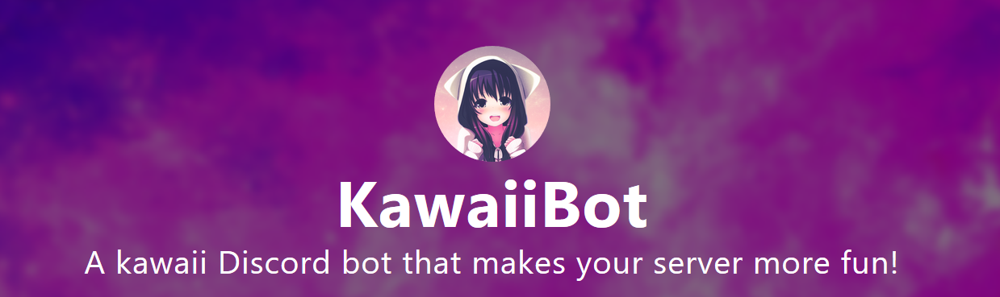

# Yvan.md

Étudiant de 20 ans en But informatique. Je fais principalement du backend et du devops.

Actuellement alternant en tant que Devops au sein du projet France Identité.

Langages connus: Javascript, Typescript, Java, Bash, PHP, C.

Blog personnel: https://blog.yvan.dev/

### 🏫 Projets scolaires

#### :bomb: Minesweeper

Le but de ce projet était de réaliser un démineur en Java.

Les sources: [demineur](https://github.com/lepeli/demineur)

### Komposant

Réalisation d'un site web dans le cadre d'une situation d'apprentissage avec pour thème le commerce circulaire

Les sources: [komposant](https://github.com/lepeli/komposant)

### 🔵⚫⚪ Mastermind Android

Création du jeu Mastermind sur Android

Les sources: [mastermind](https://github.com/lepeli/mastermind)

## Projets personnels

### Fujibot

Fujibot était un bot discord créé en python, il permettait de modérer un serveur tout en gardant trace des actions faites par des modérateurs.

Fujibot était traduit en Anglais et Français, ainsi qu'Allemand.

### Kawaiibot

[Kawaiibot](https://github.com/kawaiibot) est un bot discord pour la communauté fan d'animés.
